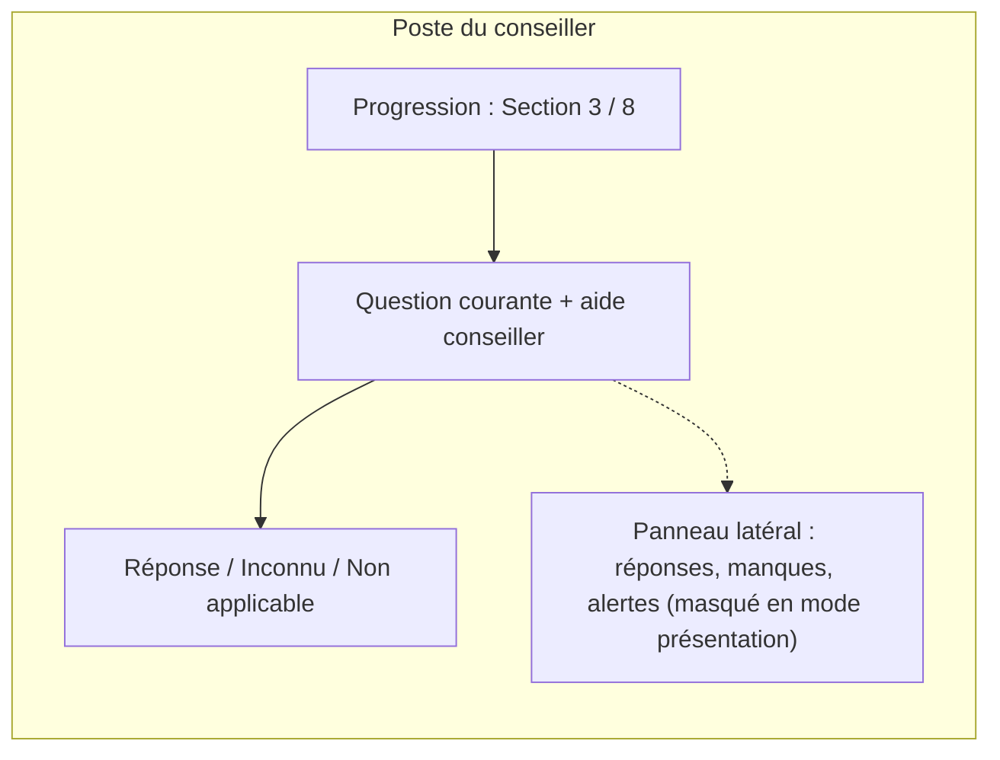

# UX et mode présentation client

> Proposition de conception (LOT 1). Aucun composant React n'est créé ou
> modifié par ce document.

## 0. Fichiers existants analysés avant toute proposition

- `client/src/components/ui.jsx` — `Modal`, `Field`, `Badge`, `Empty`, hook
  `useAsync`.
- `client/src/styles.css` — jetons de thème clair/sombre (`--page`,
  `--surface`, `--ink`, `--accent`, `--good`/`--warning`/`--serious`/
  `--critical`), composants `.card`, `.grid.cols-2/3`, `table.data`,
  `.toolbar`, `.form-grid`, `label.field`, `.sidebar`/`.nav`.
- `client/src/pages/ClientDetail.jsx` — pattern d'une fiche à cartes
  multiples (`<div className="card">`), formulaires inline avec `Field` et
  `form-grid`, messages `alert ok`/`alert error`.
- `client/src/App.jsx` — navigation latérale (`NAV`), montage des routes.
- `client/src/labels.js` — conventions de formatage (`fmtCHF`, `fmtDate`,
  `fmtDateTime`) et dictionnaires de libellés énumérés.

**Décision de conception** : aucun nouveau système de design n'est introduit.
Le module réutilise à l'identique les jetons de couleur, `.card`,
`table.data`, `Field`/`Badge`/`Empty`/`useAsync`, et le pattern de formulaire
de `ClientDetail.jsx`. Les nouveaux besoins (badges de statut de règle,
distinction visuelle mode conseiller/présentation) s'expriment par de
nouvelles valeurs dans la table `TONES` existante de `ui.jsx`, pas par un
nouveau composant de badge.

## 1. Écrans proposés

> **Statut d'implémentation (GATE LOT 2)** : seuls les écrans de gestion du
> foyer (liste, création, fiche, ajout/retrait de membre, changement de
> principal — sous-ensemble de §1.2/§1.3) sont livrés au Lot 2
> (`client/src/pages/Households.jsx`, `HouseholdDetail.jsx`). Les écrans
> 1.1 et 1.4 à 1.14 (tableau des diagnostics, sessions, questionnaire,
> findings, recommandations, consentements, mode présentation, rapport)
> restent des propositions non implémentées, réservées aux lots suivants —
> la fiche foyer actuelle affiche à leur place un état vide explicite
> (« Aucun diagnostic pour le moment »), jamais un écran qui laisserait
> croire qu'ils existent déjà. En particulier, la « désambiguïsation
> multi-foyers » de §1.2 (choix explicite exigé entre plusieurs foyers d'un
> même client) s'applique à l'écran futur de **sélection d'un foyer pour une
> session** (Lot 3+, quand plusieurs foyers existent pour la même personne
> et qu'il faut choisir lequel diagnostiquer) — elle ne s'applique pas à la
> **création** d'un foyer (Lot 2), où l'appartenance à d'autres foyers actifs
> reste, conformément à la décision GATE LOT 1 décision 1, purement
> informative et jamais bloquante (voir `Households.jsx` : bannière
> « Cette personne appartient déjà à N autre(s) foyer(s) actif(s) », jamais
> un choix imposé).

### 1.1 Tableau des diagnostics
- **Objectif** : vue d'ensemble des sessions (comme `Contracts.jsx` liste les
  contrats).
- **Affiche** : foyer, domaine, statut, date, conseiller, dernière activité.
- **Actions** : ouvrir, reprendre une session suspendue, créer une nouvelle
  session.
- **Interne uniquement** : rien de spécifique (page 100% conseiller).
- **Visible client** : aucun — cet écran n'est jamais montré.
- **État vide** : `Empty` existant (« Aucun diagnostic pour le moment »).
- **Tablette/ordinateur** : table `table.data` déjà responsive par le CSS
  existant (`grid.cols-2/3` repasse en une colonne sous 900px).

### 1.2 Création ou sélection du foyer
- **Objectif** : rattacher une session à un foyer existant ou en créer un à
  partir d'un client déjà présent dans le CRM (jamais de saisie parallèle
  d'identité — toujours via `clients` existant).
- **Affiche** : recherche de client (réutilise le pattern de recherche de
  `Clients.jsx`), aperçu du/des foyer(s) déjà existant(s) pour ce client.
- **Désambiguïsation multi-foyers (décision GATE LOT 1, décision 1, point
  7)** : si le client recherché appartient déjà à **plusieurs foyers
  actifs** (parents séparés, garde alternée, etc.), l'écran affiche
  explicitement la liste de ces foyers (label + composition résumée) et
  **exige** un choix explicite avant de continuer — jamais une sélection
  implicite du premier trouvé.
- **Détection souple de doublons à la création rapide d'une personne**
  (décision GATE LOT 1, décision 2) : lors de la création d'un nouveau
  membre de foyer (§1.3), si `POST .../members/check-similarity` renvoie une
  correspondance `exacte` ou `probable`, l'écran présente les personnes
  correspondantes avec trois actions possibles : **ouvrir la personne
  existante**, **confirmer qu'il s'agit d'une personne différente** (envoie
  `confirmed_despite_match: true`), ou **annuler la création**. Une simple
  `similarite` est affichée à titre informatif sans bloquer le flux.
- **Actions** : créer foyer, sélectionner foyer existant parmi ceux
  affichés.
- **Erreurs** : aucune erreur liée à l'appartenance à plusieurs foyers (ce
  n'est plus un cas interdit, cf. ci-dessus) — uniquement les erreurs
  usuelles de validation (client introuvable, etc.).

### 1.3 Composition du foyer
- **Objectif** : ajouter/retirer des membres, définir leur `member_role` et
  la délégation de contact des enfants.
- **Affiche** : liste des membres, chacun étiqueté sans ambiguïté soit
  « Client principal » (badge distinct, `member_role = 'principal'`), soit
  « Membre du foyer » (les autres) — **jamais un terme générique qui
  confondrait les deux** (décision GATE LOT 1, point 3.1) ; âge calculé,
  indicateur « sans coordonnées propres → contact via [représentant] ».
- **Actions** : ajouter un membre (client existant ou création rapide d'un
  enfant — voir `API_CONTRACT.md` §2 sur l'option de création rapide, avec
  vérification de similarité avant validation, cf. §1.2), définir le
  représentant légal pour délégation de contact, **changer le client
  principal** via une action dédiée et explicite (« Définir comme
  principal », qui appelle `POST .../members/:memberId/set-primary` — jamais
  un simple champ éditable dans un formulaire générique, pour que le
  changement reste toujours intentionnel et audité).
- **Ajout d'un client existant déjà membre d'un autre foyer** (décision
  GATE LOT 1, décision 1) : aucun blocage — un bandeau informatif discret
  indique « également membre de : [foyer(s)] », jamais une erreur.
- **Interne uniquement** : aucune restriction particulière, cet écran est
  toujours conseiller.
- **États vides** : foyer avec un seul membre (le principal) — normal, pas
  une erreur.
- **Erreurs** : tentative de retrait du membre principal sans être
  d'abord passé par « Définir comme principal » sur un autre membre —
  message explicite, pas un blocage silencieux.
- **Sauvegarde automatique** : chaque ajout/retrait s'enregistre
  immédiatement (comme les activités de `ClientDetail.jsx`), pas de brouillon
  local pour la composition du foyer (donnée structurante, pas un
  brouillon de rendez-vous).

### 1.4 Préparation du rendez-vous
- **Objectif** : avant la session, le conseiller voit un résumé du foyer,
  les contrats existants, les diagnostics précédents, et choisit le(s)
  domaine(s) à traiter. Cet écran s'ouvre toujours sur **un foyer déjà
  déterminé** (résolu en §1.2, y compris la désambiguïsation si la personne
  appartient à plusieurs foyers actifs) — jamais sur une personne seule sans
  foyer précisé, puisqu'une `advisory_sessions` est toujours rattachée à un
  `household_id` unique (décision GATE LOT 1, décision 1, point 6).
- **Affiche** : résumé foyer, protections existantes (lecture `contracts`,
  jamais dupliquées même si un membre appartient aussi à d'autres foyers),
  historique des sessions passées **de ce foyer précis**.
- **Actions** : créer la session (`POST /api/advisory/sessions`), choisir la
  version de questionnaire (par défaut la dernière publiée).

### 1.5 Questionnaire

> **Statut d'implémentation (Lot 3B, GATE)** : implémenté
> (`client/src/pages/SessionWorkspace.jsx`,
> `/diagnostic-360/sessions/:id/workspace`), avec les précisions suivantes
> par rapport à la proposition ci-dessous :
> - Navigation par **onglets de module** (commun/santé/vie-prévoyance,
>   jamais fusionnés visuellement) puis par section au sein du module actif
>   — non explicitement prévu par l'esquisse initiale (rédigée avant la
>   décision de composition modulaire du Lot 3A).
> - La résolution des questions (visibilité, caractère obligatoire,
>   autorisations `unknown`/`not_applicable`) est calculée **exclusivement
>   côté serveur** par une projection dédiée
>   (`getSessionWorkspace`/`GET .../workspace`) — le frontend n'appelle
>   jamais `evaluateCondition` ni ne réimplémente aucune règle de
>   validation.
> - Sauvegarde : immédiate pour les contrôles discrets (choix, booléen,
>   date), différée de 600 ms après la dernière frappe pour les champs
>   texte/numériques — jamais de bouton « Enregistrer » séparé, conforme à
>   l'objectif de ne pas casser le rythme d'un entretien en direct.
> - `help_text_client` n'est **pas** affiché dans cet écran (réservé au
>   futur mode présentation client, hors périmètre du Lot 3B) : seul
>   `help_text` (aide conseiller) est visible.
> - Mode présentation client, findings, recommandations, calculs, rapport :
>   confirmés hors périmètre du Lot 3B (voir §1 du brief du lot).
>
> **Précisions du GATE LOT 3B** (corrections apportées après une revue de
> validation dédiée, avant tout commit) :
> - **Session suspendue = réellement en pause** : aucune saisie n'est
>   possible tant que « Reprendre » n'a pas été appelé explicitement
>   (auparavant, une session suspendue acceptait encore des réponses) —
>   l'écran passe intégralement en lecture seule, comme pour une session
>   finalisée, jusqu'à la reprise.
> - **Membre historisé** : un membre retiré du foyer après le démarrage de
>   la session reste visible dans le sélecteur de membre (suffixe « retiré
>   du foyer »), avec un bandeau d'avertissement et ses champs de saisie
>   désactivés — ses réponses déjà enregistrées restent pleinement
>   consultables. Un membre ajouté au foyer après le démarrage n'apparaît
>   jamais dans la session déjà en cours.
> - **Amendement contextualisé** : chaque question répondue d'une session
>   finalisée porte désormais un bouton « Corriger cette réponse » qui
>   ouvre directement l'amendement de cette question précise, sans passer
>   par un sélecteur. Le bouton global du header reste disponible mais
>   ouvre une recherche textuelle groupée par module/section (jamais un
>   `<select>` plat), pour rester utilisable avec un questionnaire réel de
>   nombreuses questions.
> - **Concurrence entre onglets/appareils** : toute écriture est protégée
>   par la révision de la session (`API_CONTRACT.md` §3) — si la session a
>   été modifiée ailleurs entre-temps, l'écran affiche un message explicite
>   et se recharge automatiquement, sans jamais écraser silencieusement une
>   modification concurrente.
> - **Sauvegardes en attente** : avant un changement de membre/section/
>   module, une suspension, un contrôle de finalisation ou une sortie de
>   l'espace de travail, toute saisie encore en attente de débounce est
>   d'abord envoyée (`flushPendingSaves`) — une réponse tapée juste avant
>   l'une de ces actions n'est jamais perdue silencieusement.

- **Objectif** : conduire l'entretien question par question/section par
  section, en direct.
- **Affiche** : section courante, questions résolues par le moteur
  (`QUESTIONNAIRE_ENGINE.md`), progression.
- **Actions** : répondre, marquer « inconnu », marquer « non applicable »
  (désactivé si la question est obligatoire et applicable), naviguer entre
  sections déjà répondues pour correction.
- **Interne uniquement** : aide contextuelle conseiller (`help_text_
  advisor`).
- **Visible client** (si l'écran est partagé à l'écran pendant l'entretien) :
  `help_text_client` uniquement, jamais `help_text_advisor`.
- **États vides** : section sans question applicable (masquée entièrement,
  pas affichée vide).
- **Erreurs** : validation de type en temps réel (même pattern que les
  formulaires de contrat existants, message d'erreur inline).
- **Sauvegarde automatique** : écriture par lot au fil de l'eau
  (`PUT .../answers`), avec indicateur discret de sauvegarde (« enregistré »)
  — pas de bouton « Enregistrer » séparé pour ne pas casser le rythme d'un
  entretien en direct.
- **Tablette** : priorité donnée à cet écran pour un usage tablette en
  face-à-face client (boutons larges, une question par écran possible sur
  petit format — détail d'implémentation Lot 3).

### 1.6 Résumé en temps réel
- **Objectif** : pendant l'entretien, un panneau latéral (conseiller
  uniquement) montre l'état courant : nombre de réponses, informations
  manquantes, premiers constats si le diagnostic a déjà tourné une fois.
- **Interne uniquement** : entièrement — jamais montré au client.

### 1.7 Findings (constats)
- **Objectif** : lister les besoins/lacunes/avertissements produits par le
  moteur, avec leur explication et leur règle source.
- **Affiche** : `finding_type`, description, priorité, règle déclenchée
  (`stable_key` + source), statut. Pour une session `domain = mixed`,
  regroupés par domaine (`health` / `life_pension`) — jamais dans une liste
  unique non distinguée.
- **Actions** : écarter un constat (motif obligatoire).
- **Interne uniquement** : `stable_key`, `rule_execution_id`, `source`
  technique détaillée.
- **Visible client** (reformulé) : `client_explanation` uniquement, en mode
  présentation (écran 1.11).

### 1.8 Recommandations
- **Objectif** : arbitrer les catégories de solution envisagées.
- **Affiche** : catégorie, findings liés, statut (envisagée/écartée/validée).
- **Actions** : valider (irréversible sans nouvelle action, horodatée),
  écarter (motif obligatoire), marquer présentée au client, enregistrer la
  décision du client.
- **Alertes** : rappel visible si une recommandation est « envisagée » depuis
  longtemps sans arbitrage avant une tentative de génération de rapport
  final (cf. `RULES_ENGINE.md` §9).

### 1.9 Consentements
- **Objectif** : recueillir/consulter/révoquer les consentements du foyer
  par finalité.
- **Affiche** : liste des finalités (`DATA_MODEL.md` §6.1) avec statut
  actuel, date, mode de collecte.
- **Actions** : recueillir un nouveau consentement (sélection de finalité,
  version de texte affichée, mode de collecte), révoquer.
- **Cas particulier IA** : case « Assistance IA » clairement séparée,
  affichant le double statut (consentement + activation), désactivée par
  défaut, jamais pré-cochée.

### 1.10 Validation conseiller
- **Objectif** : étape explicite avant de pouvoir générer un rapport final
  — bascule les recommandations restées « envisagées » vers une décision
  (validée ou écartée), confirmation de lecture des avertissements/
  informations manquantes.
- **Interne uniquement** : entièrement.

### 1.11 Mode présentation client
- **Objectif** : écran sobre, plein écran, montré par le conseiller sur son
  propre appareil pendant le rendez-vous.
- **Affiche** : identité visuelle Legrand Conseils (réutilise `.sidebar
  .brand`/`--accent` existants, pas une nouvelle charte), composition du
  foyer (prénoms/`member_role`, pas de données sensibles superflues),
  objectifs, protections existantes, lacunes (reformulées), priorités,
  scénarios comparés par catégorie, avantages/contraintes, budget indicatif,
  prochaines étapes. **Pour une session `domain = mixed`** : deux blocs
  visuellement distincts et clairement titrés (« Assurance Maladie » /
  « Vie et Prévoyance »), jamais une liste unique mélangeant les deux
  analyses (décision GATE LOT 1, point 3.3).
- **Masque strictement** : notes internes, `stable_key`/règles techniques,
  scores/priorités numériques bruts, motifs d'écartement internes, toute
  donnée d'un autre dossier.
- **Actions client-visibles** : aucune action d'écriture — écran de lecture
  uniquement (la saisie de décision client reste faite par le conseiller
  dans l'écran 1.8, jamais directement par le client dans cette version).
- **Tablette** : écran prioritaire pour affichage tablette en vis-à-vis.

### 1.12 Génération du rapport
- **Objectif** : produire une version figée du rapport (brouillon interne,
  présentation client, final, corrigé).
- **Affiche** : aperçu avant génération, sélection du type de version.
- **Actions** : générer, télécharger (une fois la génération PDF disponible,
  Lot 9 — dans cette version, affichage structuré uniquement).
- **Alertes** : blocage explicite (pas silencieux) si des informations
  manquantes critiques subsistent, ou si aucune recommandation n'a été
  arbitrée.

### 1.13 Historique
- **Objectif** : lister toutes les sessions passées d'un foyer, avec accès
  en lecture seule à chaque version de questionnaire/règles utilisée à
  l'époque.
- **Actions** : depuis une session `termine`, « Corriger une réponse »
  ouvre le flux d'amendement (`POST .../answers/amend`, motif obligatoire)
  plutôt qu'une édition libre — l'écran affiche ensuite, le cas échéant, la
  proposition de générer un `rapport_corrige` si le résultat a changé (voir
  `REPORT_SPECIFICATION.md`).
- **Interne uniquement.**

### 1.14 Reprise d'une session
- **Objectif** : rouvrir une session `suspendu`, exactement dans l'état où
  elle a été interrompue.
- **Actions** : reprendre (`POST .../resume`), voir pourquoi elle avait été
  suspendue si un motif a été noté.

## 2. Wireframe textuel — Questionnaire (écran 1.5)



## 3. Wireframe textuel — Mode présentation client (écran 1.11)

```
┌─────────────────────────────────────────────┐
│  🛡️ Legrand Conseils — Diagnostic 360        │
├─────────────────────────────────────────────┤
│  Foyer Moret–Ricci                           │
│  Objectifs · Protections actuelles · Lacunes │
│                                               │
│  [ Assurance Maladie ]   [ Vie & Prévoyance ] │
│                                               │
│  Priorités du foyer :                        │
│   1. …                                       │
│   2. …                                       │
│                                               │
│  Budget indicatif : CHF …/mois               │
│  Prochaines étapes : …                       │
└─────────────────────────────────────────────┘
```
Sobre, une seule colonne de lecture, pas de tableau technique, pas de
navigation latérale visible (le `sidebar` conseiller est masqué en mode
présentation, comme le fait déjà l'écran de connexion `Login.jsx` qui
n'affiche pas la sidebar).

## 4. Accessibilité et responsive

- Réutilise les contrastes déjà définis dans `styles.css` (thème clair/sombre
  automatique via `prefers-color-scheme`, déjà en place).
- `Modal` existant gère déjà `Escape` et le focus de base — à réutiliser pour
  toute boîte de dialogue de confirmation (ex. validation irréversible d'une
  recommandation).
- Mode présentation : taille de police augmentée par défaut (lisibilité à
  distance sur tablette), à définir précisément en Lot 8.

## 5. Ce que ce document ne fait pas

- Ne crée aucun fichier `.jsx` ni modification de `styles.css`.
- Ne fige pas les emplacements exacts de navigation (`App.jsx`) — proposé et
  validé au Lot 2/3 au moment de l'implémentation réelle.
