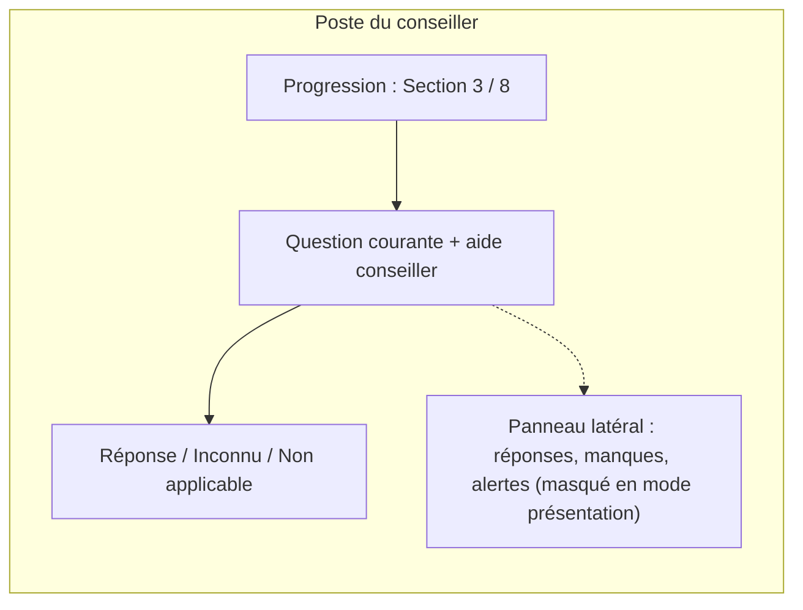
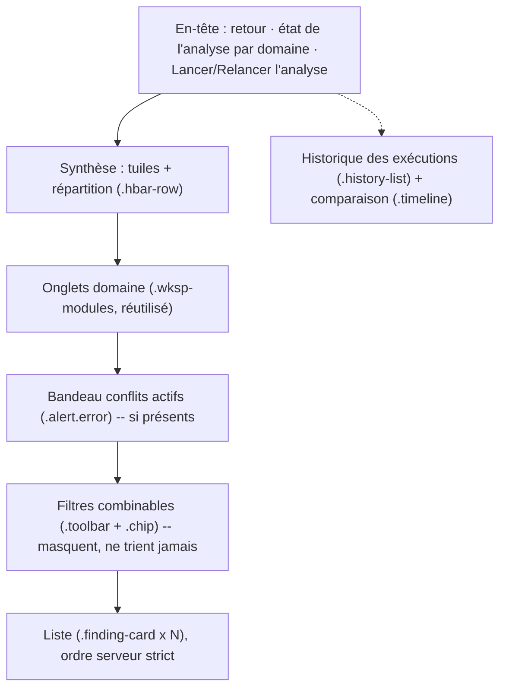

# UX et mode présentation client

> Proposition de conception (LOT 1). Aucun composant React n'est créé ou
> modifié par ce document.

## 0. Fichiers existants analysés avant toute proposition

- `client/src/components/ui.jsx` — `Modal`, `Field`, `Badge`, `Empty`, hook
  `useAsync`.
- `client/src/styles.css` — jetons de thème clair/sombre (`--page`,
  `--surface`, `--ink`, `--accent`, `--good`/`--warning`/`--serious`/
  `--critical`), composants `.card`, `.grid.cols-2/3`, `table.data`,
  `.toolbar`, `.form-grid`, `label.field`, `.sidebar`/`.nav`.
- `client/src/pages/ClientDetail.jsx` — pattern d'une fiche à cartes
  multiples (`<div className="card">`), formulaires inline avec `Field` et
  `form-grid`, messages `alert ok`/`alert error`.
- `client/src/App.jsx` — navigation latérale (`NAV`), montage des routes.
- `client/src/labels.js` — conventions de formatage (`fmtCHF`, `fmtDate`,
  `fmtDateTime`) et dictionnaires de libellés énumérés.

**Décision de conception** : aucun nouveau système de design n'est introduit.
Le module réutilise à l'identique les jetons de couleur, `.card`,
`table.data`, `Field`/`Badge`/`Empty`/`useAsync`, et le pattern de formulaire
de `ClientDetail.jsx`. Les nouveaux besoins (badges de statut de règle,
distinction visuelle mode conseiller/présentation) s'expriment par de
nouvelles valeurs dans la table `TONES` existante de `ui.jsx`, pas par un
nouveau composant de badge.

## 1. Écrans proposés

> **Statut d'implémentation (GATE LOT 2)** : seuls les écrans de gestion du
> foyer (liste, création, fiche, ajout/retrait de membre, changement de
> principal — sous-ensemble de §1.2/§1.3) sont livrés au Lot 2
> (`client/src/pages/Households.jsx`, `HouseholdDetail.jsx`). Les écrans
> 1.1 et 1.4 à 1.14 (tableau des diagnostics, sessions, questionnaire,
> findings, recommandations, consentements, mode présentation, rapport)
> restent des propositions non implémentées, réservées aux lots suivants —
> la fiche foyer actuelle affiche à leur place un état vide explicite
> (« Aucun diagnostic pour le moment »), jamais un écran qui laisserait
> croire qu'ils existent déjà. En particulier, la « désambiguïsation
> multi-foyers » de §1.2 (choix explicite exigé entre plusieurs foyers d'un
> même client) s'applique à l'écran futur de **sélection d'un foyer pour une
> session** (Lot 3+, quand plusieurs foyers existent pour la même personne
> et qu'il faut choisir lequel diagnostiquer) — elle ne s'applique pas à la
> **création** d'un foyer (Lot 2), où l'appartenance à d'autres foyers actifs
> reste, conformément à la décision GATE LOT 1 décision 1, purement
> informative et jamais bloquante (voir `Households.jsx` : bannière
> « Cette personne appartient déjà à N autre(s) foyer(s) actif(s) », jamais
> un choix imposé).

### 1.1 Tableau des diagnostics
- **Objectif** : vue d'ensemble des sessions (comme `Contracts.jsx` liste les
  contrats).
- **Affiche** : foyer, domaine, statut, date, conseiller, dernière activité.
- **Actions** : ouvrir, reprendre une session suspendue, créer une nouvelle
  session.
- **Interne uniquement** : rien de spécifique (page 100% conseiller).
- **Visible client** : aucun — cet écran n'est jamais montré.
- **État vide** : `Empty` existant (« Aucun diagnostic pour le moment »).
- **Tablette/ordinateur** : table `table.data` déjà responsive par le CSS
  existant (`grid.cols-2/3` repasse en une colonne sous 900px).

### 1.2 Création ou sélection du foyer
- **Objectif** : rattacher une session à un foyer existant ou en créer un à
  partir d'un client déjà présent dans le CRM (jamais de saisie parallèle
  d'identité — toujours via `clients` existant).
- **Affiche** : recherche de client (réutilise le pattern de recherche de
  `Clients.jsx`), aperçu du/des foyer(s) déjà existant(s) pour ce client.
- **Désambiguïsation multi-foyers (décision GATE LOT 1, décision 1, point
  7)** : si le client recherché appartient déjà à **plusieurs foyers
  actifs** (parents séparés, garde alternée, etc.), l'écran affiche
  explicitement la liste de ces foyers (label + composition résumée) et
  **exige** un choix explicite avant de continuer — jamais une sélection
  implicite du premier trouvé.
- **Détection souple de doublons à la création rapide d'une personne**
  (décision GATE LOT 1, décision 2) : lors de la création d'un nouveau
  membre de foyer (§1.3), si `POST .../members/check-similarity` renvoie une
  correspondance `exacte` ou `probable`, l'écran présente les personnes
  correspondantes avec trois actions possibles : **ouvrir la personne
  existante**, **confirmer qu'il s'agit d'une personne différente** (envoie
  `confirmed_despite_match: true`), ou **annuler la création**. Une simple
  `similarite` est affichée à titre informatif sans bloquer le flux.
- **Actions** : créer foyer, sélectionner foyer existant parmi ceux
  affichés.
- **Erreurs** : aucune erreur liée à l'appartenance à plusieurs foyers (ce
  n'est plus un cas interdit, cf. ci-dessus) — uniquement les erreurs
  usuelles de validation (client introuvable, etc.).

### 1.3 Composition du foyer
- **Objectif** : ajouter/retirer des membres, définir leur `member_role` et
  la délégation de contact des enfants.
- **Affiche** : liste des membres, chacun étiqueté sans ambiguïté soit
  « Client principal » (badge distinct, `member_role = 'principal'`), soit
  « Membre du foyer » (les autres) — **jamais un terme générique qui
  confondrait les deux** (décision GATE LOT 1, point 3.1) ; âge calculé,
  indicateur « sans coordonnées propres → contact via [représentant] ».
- **Actions** : ajouter un membre (client existant ou création rapide d'un
  enfant — voir `API_CONTRACT.md` §2 sur l'option de création rapide, avec
  vérification de similarité avant validation, cf. §1.2), définir le
  représentant légal pour délégation de contact, **changer le client
  principal** via une action dédiée et explicite (« Définir comme
  principal », qui appelle `POST .../members/:memberId/set-primary` — jamais
  un simple champ éditable dans un formulaire générique, pour que le
  changement reste toujours intentionnel et audité).
- **Ajout d'un client existant déjà membre d'un autre foyer** (décision
  GATE LOT 1, décision 1) : aucun blocage — un bandeau informatif discret
  indique « également membre de : [foyer(s)] », jamais une erreur.
- **Interne uniquement** : aucune restriction particulière, cet écran est
  toujours conseiller.
- **États vides** : foyer avec un seul membre (le principal) — normal, pas
  une erreur.
- **Erreurs** : tentative de retrait du membre principal sans être
  d'abord passé par « Définir comme principal » sur un autre membre —
  message explicite, pas un blocage silencieux.
- **Sauvegarde automatique** : chaque ajout/retrait s'enregistre
  immédiatement (comme les activités de `ClientDetail.jsx`), pas de brouillon
  local pour la composition du foyer (donnée structurante, pas un
  brouillon de rendez-vous).

### 1.4 Préparation du rendez-vous
- **Objectif** : avant la session, le conseiller voit un résumé du foyer,
  les contrats existants, les diagnostics précédents, et choisit le(s)
  domaine(s) à traiter. Cet écran s'ouvre toujours sur **un foyer déjà
  déterminé** (résolu en §1.2, y compris la désambiguïsation si la personne
  appartient à plusieurs foyers actifs) — jamais sur une personne seule sans
  foyer précisé, puisqu'une `advisory_sessions` est toujours rattachée à un
  `household_id` unique (décision GATE LOT 1, décision 1, point 6).
- **Affiche** : résumé foyer, protections existantes (lecture `contracts`,
  jamais dupliquées même si un membre appartient aussi à d'autres foyers),
  historique des sessions passées **de ce foyer précis**.
- **Actions** : créer la session (`POST /api/advisory/sessions`), choisir la
  version de questionnaire (par défaut la dernière publiée).

### 1.5 Questionnaire

> **Statut d'implémentation (Lot 3B, GATE)** : implémenté
> (`client/src/pages/SessionWorkspace.jsx`,
> `/diagnostic-360/sessions/:id/workspace`), avec les précisions suivantes
> par rapport à la proposition ci-dessous :
> - Navigation par **onglets de module** (commun/santé/vie-prévoyance,
>   jamais fusionnés visuellement) puis par section au sein du module actif
>   — non explicitement prévu par l'esquisse initiale (rédigée avant la
>   décision de composition modulaire du Lot 3A).
> - La résolution des questions (visibilité, caractère obligatoire,
>   autorisations `unknown`/`not_applicable`) est calculée **exclusivement
>   côté serveur** par une projection dédiée
>   (`getSessionWorkspace`/`GET .../workspace`) — le frontend n'appelle
>   jamais `evaluateCondition` ni ne réimplémente aucune règle de
>   validation.
> - Sauvegarde : immédiate pour les contrôles discrets (choix, booléen,
>   date), différée de 600 ms après la dernière frappe pour les champs
>   texte/numériques — jamais de bouton « Enregistrer » séparé, conforme à
>   l'objectif de ne pas casser le rythme d'un entretien en direct.
> - `help_text_client` n'est **pas** affiché dans cet écran (réservé au
>   futur mode présentation client, hors périmètre du Lot 3B) : seul
>   `help_text` (aide conseiller) est visible.
> - Mode présentation client, findings, recommandations, calculs, rapport :
>   confirmés hors périmètre du Lot 3B (voir §1 du brief du lot).
>
> **Précisions du GATE LOT 3B** (corrections apportées après une revue de
> validation dédiée, avant tout commit) :
> - **Session suspendue = réellement en pause** : aucune saisie n'est
>   possible tant que « Reprendre » n'a pas été appelé explicitement
>   (auparavant, une session suspendue acceptait encore des réponses) —
>   l'écran passe intégralement en lecture seule, comme pour une session
>   finalisée, jusqu'à la reprise.
> - **Membre historisé** : un membre retiré du foyer après le démarrage de
>   la session reste visible dans le sélecteur de membre (suffixe « retiré
>   du foyer »), avec un bandeau d'avertissement et ses champs de saisie
>   désactivés — ses réponses déjà enregistrées restent pleinement
>   consultables. Un membre ajouté au foyer après le démarrage n'apparaît
>   jamais dans la session déjà en cours.
> - **Amendement contextualisé** : chaque question répondue d'une session
>   finalisée porte désormais un bouton « Corriger cette réponse » qui
>   ouvre directement l'amendement de cette question précise, sans passer
>   par un sélecteur. Le bouton global du header reste disponible mais
>   ouvre une recherche textuelle groupée par module/section (jamais un
>   `<select>` plat), pour rester utilisable avec un questionnaire réel de
>   nombreuses questions.
> - **Concurrence entre onglets/appareils** : toute écriture est protégée
>   par la révision de la session (`API_CONTRACT.md` §3) — si la session a
>   été modifiée ailleurs entre-temps, l'écran affiche un message explicite
>   et se recharge automatiquement, sans jamais écraser silencieusement une
>   modification concurrente.
> - **Sauvegardes en attente** : avant un changement de membre/section/
>   module, une suspension, un contrôle de finalisation ou une sortie de
>   l'espace de travail, toute saisie encore en attente de débounce est
>   d'abord envoyée (`flushPendingSaves`) — une réponse tapée juste avant
>   l'une de ces actions n'est jamais perdue silencieusement.

- **Objectif** : conduire l'entretien question par question/section par
  section, en direct.
- **Affiche** : section courante, questions résolues par le moteur
  (`QUESTIONNAIRE_ENGINE.md`), progression.
- **Actions** : répondre, marquer « inconnu », marquer « non applicable »
  (désactivé si la question est obligatoire et applicable), naviguer entre
  sections déjà répondues pour correction.
- **Interne uniquement** : aide contextuelle conseiller (`help_text_
  advisor`).
- **Visible client** (si l'écran est partagé à l'écran pendant l'entretien) :
  `help_text_client` uniquement, jamais `help_text_advisor`.
- **États vides** : section sans question applicable (masquée entièrement,
  pas affichée vide).
- **Erreurs** : validation de type en temps réel (même pattern que les
  formulaires de contrat existants, message d'erreur inline).
- **Sauvegarde automatique** : écriture par lot au fil de l'eau
  (`PUT .../answers`), avec indicateur discret de sauvegarde (« enregistré »)
  — pas de bouton « Enregistrer » séparé pour ne pas casser le rythme d'un
  entretien en direct.
- **Tablette** : priorité donnée à cet écran pour un usage tablette en
  face-à-face client (boutons larges, une question par écran possible sur
  petit format — détail d'implémentation Lot 3).

### 1.6 Résumé en temps réel
- **Objectif** : pendant l'entretien, un panneau latéral (conseiller
  uniquement) montre l'état courant : nombre de réponses, informations
  manquantes, premiers constats si le diagnostic a déjà tourné une fois.
- **Interne uniquement** : entièrement — jamais montré au client.

### 1.7 Findings (constats)

> **Statut (LOT 4B, proposition client-meeting-ux)** : cette esquisse LOT 1
> est désormais dépassée sur plusieurs points constatés en lisant
> `test/advisory-rule-executions.test.js`/`server/advisoryRuleExecutions.js`
> (LOT 4A, déjà committé) — elle ignorait `finding_scope`/le membre
> concerné, la distinction conflits actifs (`conflicts_with`, recalculé) vs
> historiques (`conflicts_detected_at_execution`, immuable), et la
> distinction exécution/finding. Conservée ci-dessous comme trace
> historique uniquement ; la proposition détaillée et à jour est en
> **§5 « LOT 4B — Espace conseiller des findings »**.

- **Objectif** : lister les besoins/lacunes/avertissements produits par le
  moteur, avec leur explication et leur règle source.
- **Affiche** : `finding_type`, description, priorité, règle déclenchée
  (`stable_key` + source), statut. Pour une session `domain = mixed`,
  regroupés par domaine (`health` / `life_pension`) — jamais dans une liste
  unique non distinguée.
- **Actions** : écarter un constat (motif obligatoire).
- **Interne uniquement** : `stable_key`, `rule_execution_id`, `source`
  technique détaillée.
- **Visible client** (reformulé) : `client_explanation` uniquement, en mode
  présentation (écran 1.11).

### 1.8 Recommandations
- **Objectif** : arbitrer les catégories de solution envisagées.
- **Affiche** : catégorie, findings liés, statut (envisagée/écartée/validée).
- **Actions** : valider (irréversible sans nouvelle action, horodatée),
  écarter (motif obligatoire), marquer présentée au client, enregistrer la
  décision du client.
- **Alertes** : rappel visible si une recommandation est « envisagée » depuis
  longtemps sans arbitrage avant une tentative de génération de rapport
  final (cf. `RULES_ENGINE.md` §9).

### 1.9 Consentements
- **Objectif** : recueillir/consulter/révoquer les consentements du foyer
  par finalité.
- **Affiche** : liste des finalités (`DATA_MODEL.md` §6.1) avec statut
  actuel, date, mode de collecte.
- **Actions** : recueillir un nouveau consentement (sélection de finalité,
  version de texte affichée, mode de collecte), révoquer.
- **Cas particulier IA** : case « Assistance IA » clairement séparée,
  affichant le double statut (consentement + activation), désactivée par
  défaut, jamais pré-cochée.

### 1.10 Validation conseiller
- **Objectif** : étape explicite avant de pouvoir générer un rapport final
  — bascule les recommandations restées « envisagées » vers une décision
  (validée ou écartée), confirmation de lecture des avertissements/
  informations manquantes.
- **Interne uniquement** : entièrement.

### 1.11 Mode présentation client
- **Objectif** : écran sobre, plein écran, montré par le conseiller sur son
  propre appareil pendant le rendez-vous.
- **Affiche** : identité visuelle Legrand Conseils (réutilise `.sidebar
  .brand`/`--accent` existants, pas une nouvelle charte), composition du
  foyer (prénoms/`member_role`, pas de données sensibles superflues),
  objectifs, protections existantes, lacunes (reformulées), priorités,
  scénarios comparés par catégorie, avantages/contraintes, budget indicatif,
  prochaines étapes. **Pour une session `domain = mixed`** : deux blocs
  visuellement distincts et clairement titrés (« Assurance Maladie » /
  « Vie et Prévoyance »), jamais une liste unique mélangeant les deux
  analyses (décision GATE LOT 1, point 3.3).
- **Masque strictement** : notes internes, `stable_key`/règles techniques,
  scores/priorités numériques bruts, motifs d'écartement internes, toute
  donnée d'un autre dossier.
- **Actions client-visibles** : aucune action d'écriture — écran de lecture
  uniquement (la saisie de décision client reste faite par le conseiller
  dans l'écran 1.8, jamais directement par le client dans cette version).
- **Tablette** : écran prioritaire pour affichage tablette en vis-à-vis.

### 1.12 Génération du rapport
- **Objectif** : produire une version figée du rapport (brouillon interne,
  présentation client, final, corrigé).
- **Affiche** : aperçu avant génération, sélection du type de version.
- **Actions** : générer, télécharger (une fois la génération PDF disponible,
  Lot 9 — dans cette version, affichage structuré uniquement).
- **Alertes** : blocage explicite (pas silencieux) si des informations
  manquantes critiques subsistent, ou si aucune recommandation n'a été
  arbitrée.

### 1.13 Historique
- **Objectif** : lister toutes les sessions passées d'un foyer, avec accès
  en lecture seule à chaque version de questionnaire/règles utilisée à
  l'époque.
- **Actions** : depuis une session `termine`, « Corriger une réponse »
  ouvre le flux d'amendement (`POST .../answers/amend`, motif obligatoire)
  plutôt qu'une édition libre — l'écran affiche ensuite, le cas échéant, la
  proposition de générer un `rapport_corrige` si le résultat a changé (voir
  `REPORT_SPECIFICATION.md`).
- **Interne uniquement.**

### 1.14 Reprise d'une session
- **Objectif** : rouvrir une session `suspendu`, exactement dans l'état où
  elle a été interrompue.
- **Actions** : reprendre (`POST .../resume`), voir pourquoi elle avait été
  suspendue si un motif a été noté.

## 2. Wireframe textuel — Questionnaire (écran 1.5)



## 3. Wireframe textuel — Mode présentation client (écran 1.11)

```
┌─────────────────────────────────────────────┐
│  🛡️ Legrand Conseils — Diagnostic 360        │
├─────────────────────────────────────────────┤
│  Foyer Moret–Ricci                           │
│  Objectifs · Protections actuelles · Lacunes │
│                                               │
│  [ Assurance Maladie ]   [ Vie & Prévoyance ] │
│                                               │
│  Priorités du foyer :                        │
│   1. …                                       │
│   2. …                                       │
│                                               │
│  Budget indicatif : CHF …/mois               │
│  Prochaines étapes : …                       │
└─────────────────────────────────────────────┘
```
Sobre, une seule colonne de lecture, pas de tableau technique, pas de
navigation latérale visible (le `sidebar` conseiller est masqué en mode
présentation, comme le fait déjà l'écran de connexion `Login.jsx` qui
n'affiche pas la sidebar).

## 4. Accessibilité et responsive

- Réutilise les contrastes déjà définis dans `styles.css` (thème clair/sombre
  automatique via `prefers-color-scheme`, déjà en place).
- `Modal` existant gère déjà `Escape` et le focus de base — à réutiliser pour
  toute boîte de dialogue de confirmation (ex. validation irréversible d'une
  recommandation).
- Mode présentation : taille de police augmentée par défaut (lisibilité à
  distance sur tablette), à définir précisément en Lot 8.

## 5. LOT 4B — Espace conseiller des findings (implémenté)

> **Statut : implémenté.** Cette section reste la proposition de conception
> d'origine (utile comme trace du raisonnement), MAIS le code réel
> (`client/src/pages/SessionFindings.jsx`,
> `server/advisoryRuleExecutions.js`) fait foi en cas de divergence.
> Écarts constatés entre cette proposition et l'implémentation finale :
> - **§5.1 (ordre serveur)** — tranché CÔTÉ SERVEUR, pas seulement
>   visuellement comme envisagé ici par prudence : `FINDINGS_ORDER_BY`
>   (`server/advisoryRuleExecutions.js`) trie désormais bien
>   `needs_review DESC` en tête, avant la priorité (voir `RULES_ENGINE.md`
>   §3ter). Le frontend n'a donc pas eu besoin d'un « bandeau séparé » pour
>   faire ressortir les conflits — l'ordre du serveur suffit, un badge
>   « Conflit actif (N) » reste affiché sur la carte elle-même.
> - **§5.3 (tuiles de synthèse)** — simplifié à trois tuiles (Constats
>   actifs / Conflits à examiner / Écartés) plutôt que les cinq envisagées
>   ici ; pas de tuile « Membres concernés » ni « Dernière analyse »
>   séparée (la date figure dans la bannière d'état du domaine).
> - **§5.11 (états de domaine)** — quatre états retenus
>   (`no_rule_set_available`/`not_yet_run`/`up_to_date`/`stale`, voir
>   `API_CONTRACT.md` §6/§7) plutôt que les six badges envisagés ici ;
>   `running` n'a pas d'état dédié dans l'UI (le moteur reste synchrone,
>   `analyzing` local suffit pendant l'attente) ; un dernier essai en échec
>   (`last_attempt_failed`) est signalé par une bannière distincte plutôt
>   qu'un badge d'état à part entière.
> - **§5.6 (navigation source)** confirmée telle que proposée à l'origine,
>   PUIS étendue par le GATE ciblé (§2) : état de navigation React Router
>   toujours jamais dans l'URL, mais porte désormais `{questionId, memberId,
>   answerId}` — `answerId` (la ligne immuable déjà capturée au Lot 4A dans
>   `used_inputs_ref`) devient la source de vérité pour positionner
>   l'historique EXACTEMENT sur la réponse utilisée, jamais seulement la
>   réponse active courante. `SessionWorkspace.jsx` étendu avec surlignage
>   temporaire + focus clavier de la question live (comportement d'origine,
>   inchangé), ET ouverture de la modale d'historique positionnée/badgée sur
>   la ligne exacte (ajout GATE §2) — y compris quand la question live est
>   masquée ou provient d'un membre historique. Un `answerId` invalide
>   (cinq cas distincts testés séparément, MICRO-GATE §2) affiche le message
>   neutre exact *« La réponse historique demandée n'est pas disponible pour
>   cette session. »*, sans jamais préciser lequel des cinq s'applique.
> - **§5.2 (route/écran)** confirmée telle que proposée à l'identique :
>   `SessionFindings.jsx`, `/diagnostic-360/sessions/:id/findings`.
> - **Point non anticipé ici, ajouté à l'implémentation** : un bouton
>   unique « Lancer l'analyse » orchestre désormais TOUS les domaines
>   applicables en un seul appel (`POST .../analyze`,
>   `executeApplicableRuleSetsForSession`), plutôt qu'un lancement
>   domaine par domaine — voir `RULES_ENGINE.md` (relance après
>   amendement) et `API_CONTRACT.md` §6.
> - **Point non anticipé ici, ajouté par le GATE ciblé (§3), affiné par le
>   MICRO-GATE (§3) puis par un correctif final**  : un badge d'état global
>   agrégé (en-tête) et un bandeau « Synthèse active » (session mixte
>   uniquement) au-dessus des onglets de domaine — `common`, quand un
>   ensemble de règles lui est ACTUELLEMENT publié (statut `published` au
>   moment de la lecture, jamais « déjà publié un jour » — un ensemble
>   seulement archivé ne compte plus), pèse désormais dans le badge d'état
>   global exactement comme un domaine requis (son échec/obsolescence n'est
>   jamais masqué au seul motif qu'il reste par ailleurs facultatif en son
>   absence) — voir `RULES_ENGINE.md` §3quater et `API_CONTRACT.md` §7.
>
> Détail complet de l'exécution et des défauts réels détectés et corrigés
> pendant la QA (détection de conflit trop large sur les findings fan-out
> d'une même règle ; débordement horizontal à 375px ; fenêtre de course
> dans la garde anti-double-clic, corrigée par le GATE ciblé §7 ; sémantique
> de `common` dans l'état global, corrigée par le MICRO-GATE §3 puis
> affinée par un correctif final sur le statut de publication actuel) :
> `LOT4B_MANUAL_UI_CHECKLIST.md`.

> Proposition de conception d'origine (avant implémentation) — conservée
> ci-dessous pour sa valeur de trace historique. Périmètre strictement
> conseiller : jamais de recommandation finale, produit, assureur, IA,
> score global ou note commerciale/médicale — le moteur LOT 4A ne produit
> d'ailleurs aucun de ces éléments (`server/db.js`, commentaire sur
> `advisory_findings` : « Jamais une recommandation : aucun champ produit,
> aucun champ assureur »).

### 5.0 Fichiers analysés pour cette proposition

- `client/src/components/ui.jsx` — `Modal`, `Field`, `Badge`+`TONES`,
  `Empty`, `useAsync`.
- `client/src/labels.js` — dictionnaires existants (`LINK_DOMAIN_LABELS`,
  `SESSION_STATUSES`, `BRANCHES`, `CONTRACT_STATUS`, `MEMBER_ROLES`) et
  `fmtCHF`/`fmtDate`/`fmtDateTime`.
- `client/src/styles.css` — jetons `--good`/`--warning`/`--serious`/
  `--critical`, `.card`, `.tiles`/`.tile`, `.badge`, `.alert`, `.modal`,
  `table.data`, `.hbar-row`/`.viz-legend`, `.kcard details`, et tout le
  bloc « Workspace de rendez-vous (Lot 3B) » (`.wksp-*`, `.missing-list`,
  `.history-list`, `.timeline`, `.save-state`, `.readonly-banner`,
  `.amend-picker`).
- `client/src/pages/SessionWorkspace.jsx` (lu en entier) — `jumpTo`,
  `resolveMissingContext`, `FinalizationModal`, `AmendModal`,
  `HistoryModal`, le hook `useWorkspace`, la gestion de révision/
  anti-double-clic (`runTransition`, `enqueueWrite`), le pattern
  `save-state`+`aria-live`.
- `client/src/pages/SessionDetail.jsx` — fiche session, boutons d'action
  conditionnés par `data.status` (pattern local, distinct de
  `actions.can_*` côté Workspace).
- `client/src/App.jsx` — table `NAV`, routes
  `/diagnostic-360/sessions/:id` et `/diagnostic-360/sessions/:id/workspace`.
- `docs/advisory/UX_AND_CLIENT_MODE.md` §1.7 — proposition LOT 1 d'origine,
  désormais dépassée (voir note en tête de §1.7).
- `test/advisory-rule-executions.test.js` (lu en entier) et
  `server/advisoryRuleExecutions.js`, `server/db.js` (schéma
  `advisory_rule_executions`/`advisory_findings`) — pour la forme exacte
  des données : `finding_type`, `priority`, `finding_scope`, `status`,
  `needs_review`, `conflicts_with` (actif, recalculé) vs
  `conflicts_detected_at_execution` (historique, immuable),
  `used_inputs_ref`, `missing_data`, `content_hash`,
  `rule_set_version_number`, `superseded_by_execution_id`. **Aucun fichier
  serveur n'est modifié par ce document** — lu uniquement pour fonder les
  propositions d'écran ci-dessous.

### 5.1 Constat préalable — ordre serveur des findings

`server/advisoryRuleExecutions.js` (`FINDINGS_ORDER_BY`) trie déjà
`critical > high > medium > low`, puis `sort_order`, puis `id` — **mais ne
met pas les conflits actifs en tête**, à la différence de l'énoncé de ce
lot. Cet ordre est déjà partagé par les trois routes de lecture (constat
tracé dans le code, GATE LOT 4A §12). Proposition retenue ci-dessous : ne
**jamais** retrier la liste côté client (les filtres masquent, ils ne
trient jamais), et faire ressortir les conflits **visuellement** via un
bandeau séparé (§5.6), pas par un tri de la liste. **Point à valider avec
`advisory-architect`/le domaine des règles** : un vrai tri « conflits
d'abord » serait un changement de requête SQL, hors périmètre d'écriture
de ce document.

### 5.2 Écran et route (hypothèse de navigation)

Hypothèse : nouvelle page `SessionFindings.jsx`, route
`/diagnostic-360/sessions/:id/findings`, sœur de `.../workspace`. Accès
depuis `SessionDetail.jsx` : nouveau bouton « Ouvrir les constats »,
visible seulement si `data.status === 'completed'` (l'exécution finale
exige déjà une session `completed`, GATE LOT 4A §9) — sinon un texte
explicatif, sur le modèle du paragraphe déjà présent sous « Questionnaire
et réponses » dans `SessionDetail.jsx`. **Emplacement exact dans la
navigation et nom de route à valider par vous avant implémentation.**

### 5.3 Point 1 — Synthèse en tête de page

Tuiles `.tiles`/`.tile` (identiques à celles de `SessionWorkspace.jsx`) :
« Findings actifs », « Conflits actifs » (tuile neutre à 0, signalée si
>0), « Informations manquantes », « Membres concernés » (uniquement
`finding_scope = member`, légende précisant que les constats de portée
foyer/session n'y sont pas comptés), « Dernière analyse » (date + révision
par domaine). Répartition domaine/type/priorité : réutilise le composant
graphique déjà existant `.hbar-row`/`.viz-legend` (barres horizontales),
aucun nouveau composant de visualisation. **Jamais** de tuile de score
global — strictement des comptes.

### 5.4 Point 2 — Filtres et regroupements

`.toolbar` existant + `<select>` pour domaine (si non fixé par l'onglet),
membre, statut ; bascules « Conflits uniquement » / « Informations
manquantes uniquement » en puces cliquables (nouvelle classe minimale
`.chip`, voir §5.13). Regroupement optionnel « par membre »/« par domaine »
réutilise exactement le pattern `Map` déjà employé par `AmendModal`
(`grouped = useMemo(() => new Map(...))`) — chaque sous-groupe garde
l'ordre serveur en interne, jamais retrié. Règle explicite : un filtre
**masque** (`Array.filter`), il ne **trie jamais** — voir §5.1.

### 5.5 Point 3 — Carte de finding

Nouvelle classe minimale `.finding-card` (mêmes règles d'espacement que
`.wksp-question` : `padding:16px 0; border-bottom:1px solid var(--grid)`),
dans un conteneur `.card`. Contenu : `Badge` type (nouvelles entrées
`TONES`, §5.13) + `Badge` priorité + libellé domaine (`LINK_DOMAIN_LABELS`,
déjà existant) + portée/membre en texte simple ; titre (`title`) ; résumé
(`summary`) ; **explication conseiller** (`advisor_explanation`) toujours
visible, jamais repliée (espace 100 % conseiller) ; `missing_data` en
`.missing-list` (déjà stylé) ; `warnings`/`contraindications` en
`.alert.warn`/`.alert.error` (réutilisés tels quels) ; `Badge` statut
(`active`/`dismissed`/`superseded`, nouvelles entrées `TONES`) ; actions
« Voir la source », « Sources et traçabilité » (accordéon), « Écarter »
(si actif). `client_explanation` existe dans la donnée mais **n'est pas
affiché ici** (texte destiné à un futur mode présentation client, hors
périmètre de ce lot) — s'il devait apparaître en aperçu conseiller, le
signaler sans ambiguïté comme « texte destiné au client », jamais confondu
visuellement avec `advisor_explanation` (point à valider, §5.17).

### 5.6 Point 4 — Conflits actifs vs historique

Bandeau `.alert.error` (réutilisé tel quel — ton déjà assez sévère, pas de
nouvelle classe) en tête de chaque domaine où `needs_review = 1` existe
parmi les findings actifs : liste les groupes de findings mutuellement en
conflit via des lignes `.missing-list button.link-row` (déjà stylées,
flèche « → ») qui **font défiler** jusqu'à la carte correspondante dans la
liste (ancre, jamais de choix automatique proposé). Dans l'historique
(§5.10), un finding dont `conflicts_detected_at_execution` est non vide
mais dont le `needs_review` actuel est à 0 affiche une puce neutre
discrète (`badge` avec une valeur non mappée dans `TONES` → ton gris par
défaut) « Conflit historique (résolu depuis) » — jamais la même couleur
alarmante que le bandeau actif.

### 5.7 Point 5 — Sources et traçabilité

`<details>/<summary>` (clavier natif, aucun JS requis) — réutilise les 4
règles déjà définies pour `.kcard details` dans `styles.css`, étendues au
sélecteur `.finding-card details` (une ligne à ajouter, pas un nouveau
pattern). Contenu en paires libellé/valeur (réutilise le motif déjà
employé par la carte « Informations » de `SessionDetail.jsx`, **jamais**
de JSON brut) : règle (`stable_key`, `title`), ensemble de règles (nom,
domaine, `rule_set_version_number`), `content_hash` tronqué avec légende
obligatoire — *« empreinte technique de la version des règles utilisée —
sert à vérifier la reproductibilité, ne constitue pas une preuve
juridique »* —, `source`/`source_reference`, `effective_from` (`fmtDate`),
exécution (`fmtDateTime(started_at)`, `engine_version`, `mode`). Entrées
utilisées (`used_inputs_ref`) : pour `kind: 'answer'`, texte de la
question + membre + `Badge value="serious" label="Donnée sensible"` si
`sensitivity_at_execution` (badge identique à celui déjà utilisé dans
`QuestionCard`) + lien « Voir la réponse » (§5.8) ; pour
`kind: 'contract_branch'`, libellés déjà existants `BRANCHES`/
`CONTRACT_STATUS` ; pour `kind: 'rule_result'`, `stable_key` de la règle
dont dépend celle-ci.

### 5.8 Point 6 — Navigation vers la réponse source

**Constat bloquant pour ce document** : `used_inputs_ref` (réponse) porte
`question_id`/`questionnaire_version_id`/`household_member_id`, mais
**jamais** de `sectionKey` ni de `moduleIdx`. `jumpTo(moduleIdx,
sectionKey, memberId)` (`SessionWorkspace.jsx`) ne peut donc pas être
appelé directement avec les seules données du finding. Solution proposée,
sans changement serveur : au clic sur « Voir la source », naviguer vers
`.../workspace` avec un état de navigation (`navigate(path, { state:
{ questionId, memberId } })`) ; au montage, `SessionWorkspace`
retrouverait `moduleIdx`/`sectionKey` en réutilisant **la même recherche
linéaire déjà écrite** pour `resolveMissingContext` (adaptée à un
`questionId` fourni directement), puis appellerait `jumpTo`. **Ceci
modifie un composant existant (`SessionWorkspace.jsx`) : hors périmètre
d'écriture de ce document — proposé comme spécification pour le lot
d'implémentation, à valider.** Comme l'exécution finale exige une session
`completed` (GATE LOT 4A §9), le workspace ouvert sera déjà naturellement
en lecture seule (`readOnly = !actions.can_record_answers`) — aucun
paramètre « lecture seule » supplémentaire n'est nécessaire.

### 5.9 Point 7 — Écartement

Modal réutilisant `Modal`+`Field`, calqué exactement sur `AmendModal`
(motif obligatoire en `textarea`, garde `if (submitting) return;`,
`button.danger` pour confirmer, message dédié en cas de 409, **mise à
jour visuelle uniquement après la réponse serveur** — jamais optimiste).
Déclencheur : `button.ghost` sur la carte. Confirmation :
`aria-live="polite"` sur un indicateur façon `.save-state`, erreurs en
`role="alert" aria-live="assertive"` (mêmes classes que `.q-error`).

### 5.10 Point 8 — Historique des exécutions

`.history-list` (déjà stylé, identique à `HistoryModal`) par domaine :
date, `Badge` statut d'exécution (nouvelles entrées `TONES` : `running`,
`failed` — `completed` existe déjà), ensemble de règles (nom, version,
hash tronqué), `rules_evaluated_count`/`findings_count`, conseiller
exécutant. Confirmé lisible même foyer archivé/`rule_set` archivé/session
amendée (`test/advisory-rule-executions.test.js`, lignes 914-951) —
l'écran ne doit donc **jamais** masquer une exécution historique sous
prétexte que sa donnée source a changé depuis. « Comparer à l'état actif »
: réutilise `.timeline` (déjà stylé, inutilisé ailleurs à ce jour) pour un
diff compact nouveau/toujours actif/écarté depuis/absent depuis, entre
l'exécution sélectionnée et l'état actif courant.

### 5.11 Point 9 — En-tête et état de l'analyse

Un `Badge` d'état par domaine, jamais un score : *jamais analysée* (ton
neutre), *à jour* (`good`), *obsolète après amendement* (`warn` —
comparaison `execution.session_revision < session.revision`, faite
**uniquement** sur des données déjà rechargées du serveur, jamais
immédiatement après l'envoi d'une action avant confirmation), *partielle*
(`warn`, session `mixed` avec au moins un domaine non à jour),
*impossible faute de rule_set* (`serious`, distingue l'échec 409 « aucun
rule_set publié »), *erreur* (`critical`, `status = 'failed'`), *en cours*
(`info`, `status = 'running'` — schéma déjà prévu même si le moteur est
aujourd'hui synchrone). Bouton unique « Lancer l'analyse »/« Relancer
l'analyse » (libellé selon l'état), implémenté sur le **même** patron que
`runTransition` de `SessionWorkspace.jsx` (garde anti-double-clic,
rechargement serveur avant tout changement visuel d'état).

### 5.12 Point 10 — Tablette et accessibilité

Bandeau sticky `.wksp-progress-sticky` réutilisé tel quel sous 900px pour
la synthèse condensée (actifs/conflits/manquants). Onglets domaine :
`.wksp-modules` réutilisé tel quel. Cibles tactiles : même convention que
GATE LOT 3B §12, étendue à `.finding-card` et `.chip` (min-height
40-44px). `<details>` natif = clavier gratuit. Puces de filtre toujours
des `<button>` réels (jamais un `<div onClick>`). Contraste : uniquement
les jetons déjà définis, aucune couleur nouvelle. **Signalé, hors
périmètre d'écriture** : `button:focus-visible` n'a pas de style dédié
dans `styles.css` aujourd'hui (seuls `input/select/textarea:focus` en ont
un) — lacune préexistante qui touchera aussi les nouveaux boutons de
cette page ; à corriger globalement, pas seulement pour ce lot.

### 5.13 Nouvelles classes/valeurs CSS minimales (récapitulatif)

- `TONES` (`ui.jsx`, table déjà conçue pour être étendue — voir §0 du
  présent document) : `critical`, `high`, `medium`, `low` (priorité) ;
  `active`, `dismissed`, `superseded` (statut finding) ; `running`,
  `failed` (statut exécution — `completed` existe déjà).
- `.chip`/`.chip-group` (`styles.css`) — puce de filtre cliquable, ~40px.
- `.finding-card`, `.finding-card .f-head`, `.finding-card .f-actions`
  (mêmes valeurs d'espacement que `.wksp-question`/`.q-actions`).
- Étendre le sélecteur existant `.kcard details` en `.kcard details,
  .finding-card details` (une ligne).

Tout le reste (`.tiles`/`.tile`, `.alert.*`, `.missing-list`,
`.history-list`, `.timeline`, `.save-state`, `.wksp-modules`,
`.wksp-progress-sticky`, `Modal`/`Field`/`Badge`/`Empty`) est réutilisé
sans modification.

### 5.14 Nouveaux libellés proposés (`labels.js`)

`FINDING_TYPES`, `PRIORITIES`, `FINDING_SCOPES`, `FINDING_STATUSES`,
`EXECUTION_STATUSES` — dictionnaires français sur le modèle de
`SESSION_STATUSES`/`ANSWER_STATUSES` déjà présents, valeurs exactes
issues de `server/db.js` (`fact`/`detected_need`/`gap`/`warning`/
`missing_information`/`solution_category`, `low`/`medium`/`high`/
`critical`, `session`/`household`/`member`, `active`/`dismissed`/
`superseded`, `running`/`completed`/`failed`/`superseded`).

### 5.15 Wireframes



```
┌───────────────────────────────────────────┐
│ ← Session   Constats — Foyer X   [état]    │
│ [Lancer/Relancer l'analyse]                │
├───────────────────────────────────────────┤
│ Actifs 6 · Conflits 1 · Manquants 2 · …    │
│ [Commun] [Maladie] [Vie & Prévoyance]      │
│ ⚠ Conflit actif : Constat A ⇄ Constat B    │
│ [Filtres: membre▾ type▾ priorité▾ statut▾] │
│ ── Constat (priorité, type, membre) ──     │
│   résumé · explication conseiller          │
│   [Voir la source] [Sources ▾] [Écarter]   │
└───────────────────────────────────────────┘
```
Paysage tablette/ordinateur : synthèse et filtres sur une ligne. Portrait
tablette (<900px) : bandeau `.wksp-progress-sticky` condensé, onglets
domaine en défilement horizontal (déjà le comportement de
`.wksp-modules`/`.wksp-rail` sous 900px), une carte par ligne.

### 5.16 Hypothèses de conception à confirmer

1. Route `/diagnostic-360/sessions/:id/findings` et bouton d'entrée dans
   `SessionDetail.jsx` conditionné à `status === 'completed'`.
2. Contrat exact d'une éventuelle projection serveur agrégée (façon
   `getSessionWorkspace`) pour éviter au client de recomposer la synthèse
   à partir de plusieurs appels (`listExecutions`+`listActiveFindings`) —
   non spécifié ici, relève d'`advisory-architect`.
3. Extension de `SessionWorkspace.jsx` pour accepter un `questionId` de
   navigation entrante (§5.8) — lot d'implémentation distinct.
4. Comportement exact si `common` n'a jamais été rattaché à la session :
   onglet « Commun » absent, ou affiché avec un état « non applicable » ?

### 5.17 Points nécessitant une validation humaine

- Ordre « conflits d'abord » (§5.1) : rester sur un bandeau séparé (aucun
  changement serveur), ou demander un changement de `FINDINGS_ORDER_BY`
  (hors périmètre de ce document) ?
- Emplacement définitif dans `App.jsx`/`NAV` — aucune entrée « findings »
  dans la navigation latérale actuelle, accès uniquement envisagé depuis
  une session précise ; à confirmer.
- Faut-il exposer un aperçu de `client_explanation` dans cette page
  conseiller (§5.5), et si oui sous quelle mise en garde visuelle ?

## 6. Ce que ce document ne fait pas

- Ne crée aucun fichier `.jsx` ni modification de `styles.css`.
- Ne fige pas les emplacements exacts de navigation (`App.jsx`) — proposé et
  validé au Lot 2/3/4B au moment de l'implémentation réelle.
- La section 5 (LOT 4B) est une proposition non implémentée, listant
  explicitement ses points de blocage/validation (§5.16, §5.17).
